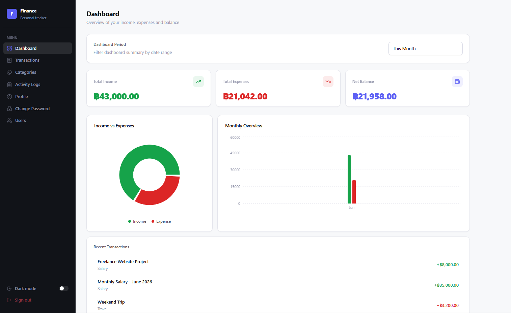
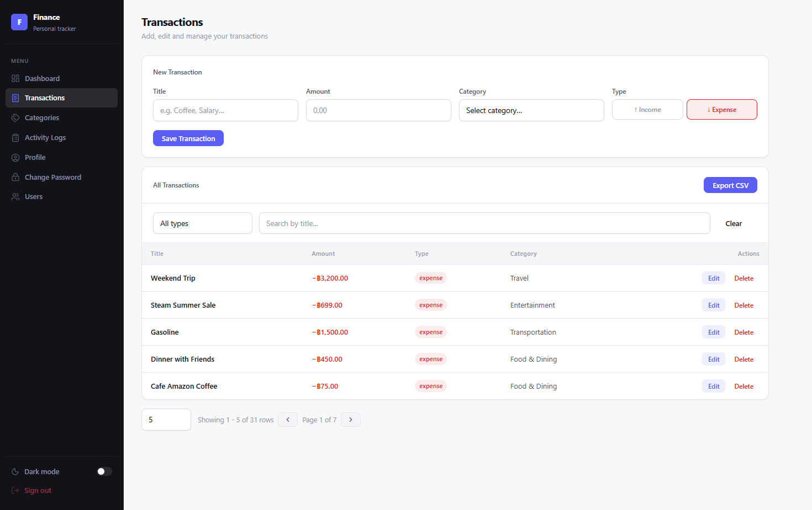
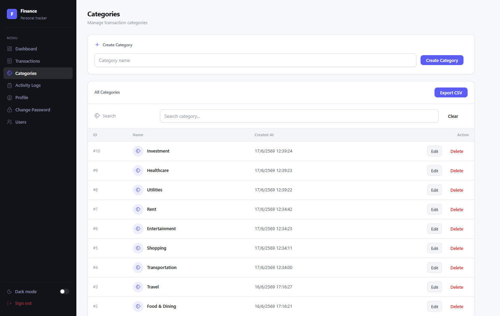
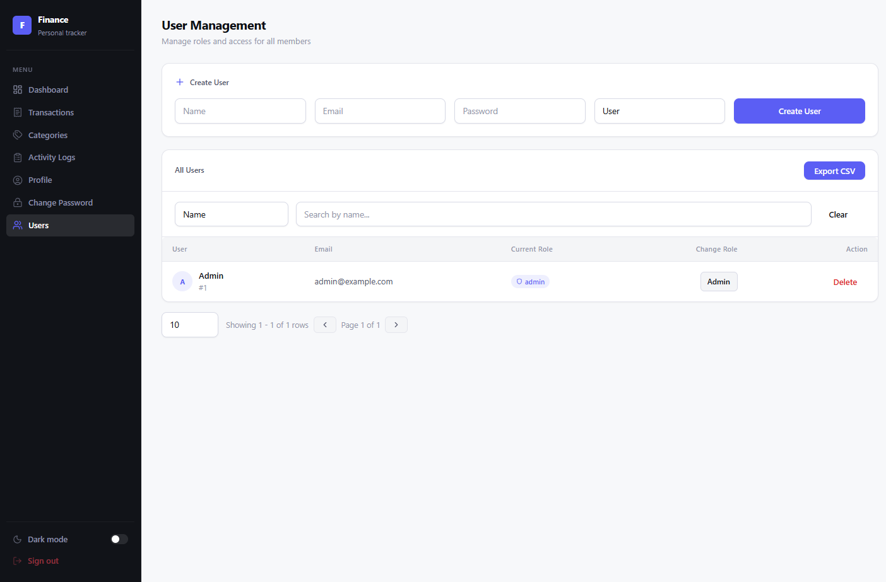

# Personal Finance Dashboard

A full-stack personal finance management system built with Laravel and React.

## Live Demo

Frontend:
https://xxxxx.vercel.app

Backend:
https://xxxxx.up.railway.app

## Features

- Authentication (Laravel Sanctum)
- Dashboard Overview
- Income & Expense Tracking
- Categories Management
- Activity Logs
- CSV Export
- Role-based Access Control
- Admin User Management
- Change Password
- Pagination & Search

## Tech Stack

### Frontend

- React
- Vite
- Axios
- React Router
- Recharts
- Lucide React

### Backend

- Laravel 12
- Sanctum
- MySQL
- PHPUnit

### Deployment

- Vercel
- Railway
- GitHub Actions

## Screenshots

### Dashboard



### Transactions



### Categories



### Admin Users



## Run Locally

### Frontend

```bash
npm install
npm run dev
```

### Backend

```bash
composer install
php artisan migrate
php artisan serve
```

## Testing

```bash
php artisan test
```
